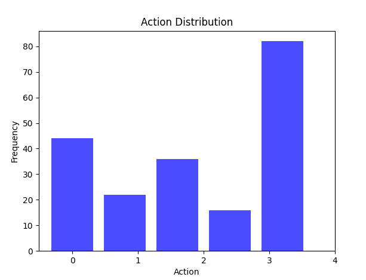

. 模型训练
    1. 官方的基于stable_baselines3的DQN的训练脚本没有效果，看是否能找到训练好的
    2. 训练好的
    3. 环境wrapper需要学习
    4. 

2. top-K

    1. 搞清楚师兄代码中的actiavations：
    2. 要保存所有样本的activation。。
    3. 

要提取网络内部的激活值需要注册钩子函数，尝试在DQN网络中直接注册，然后提取。

师兄代码逻辑：
1. register_test.py文件：注册钩子函数并提取激活值，存放到了middle_result/{set_name}_{i}.data文件
2. find_test.py：读取上述middle_result/{set_name}_{i}.data激活值文件，调用了find.top_k_finder.Find类，
3. sampler_test.py文件：读取上述middle_result/{set_name}_{i}.data文件与   ，调用find.sampler.Sampler类，

log
- 7.18前：现了关键神经元提取的算法（略过1w字） 
- 7.18：实现神经网络的模型压缩

model/AV_model/highway_dqn/20000steps_2 这个模型效果不错

- 9.4：
   - 训练PPO模型，但是模型训练结构不如意，偏向于保守策略，action分布情况如下：
      
   - 
- 9.5：
  - 想写一个总的配置文件，包含所有配置项，但是感觉不太好实现。
  > 对于模型训练脚本，需要配置各种训练参数，对于日志收集类需要配置模型路径、日志保存路径，对于日志分析脚本需要配置日志路径以及分析数据路径
  - 

- 1.15
  - 调整highwayenv环境的'offroad_terminal'参数为True,出了道路则终止episode,之前PPO算法训练没效果要给是因为这个
  - 整理毕业论文框架文档
  - 
- 1.20 
  - 模型效果不好，发现车倒着跑，修改reward，添加"low_speed_reward":0 if self.vehicle.speed < 0 else 1一项
  - 
- 1.22
  - 模型效果依旧不理想，仍然出现reward为负值。 
  - 代码改动：添加一项reward："negative_speed_terminal": False,    "negative_speed_reward":-1,
  - _reward()函数以及_is_terminated()函数做相应更改

python main.py --env --alg --obs --act --net --policy_freq --simulate-freq --reward_speed_range --high_speed_reward --number_of_expirements --total_timesteps 10000

python main.py --net [128] --number_of_expirements 1 --total_timesteps

